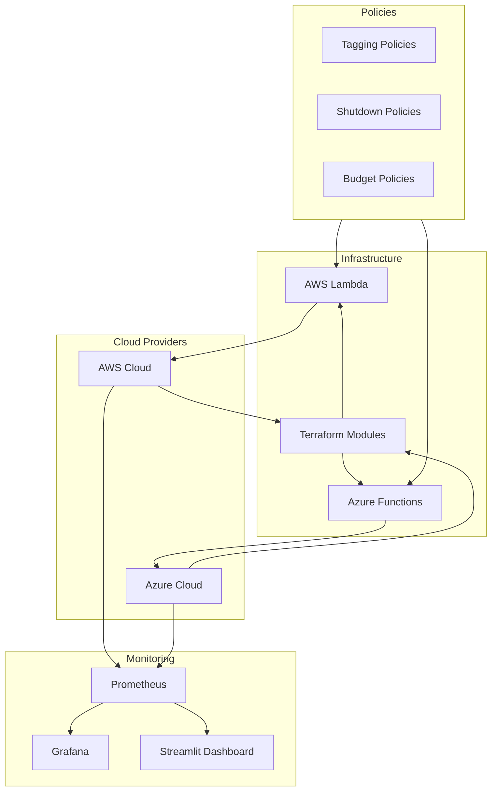

# Cost Optimization Framework

A comprehensive, production-ready solution for automated cloud cost analysis, right-sizing, policy enforcement, and scheduled shutdown features across AWS and Azure environments.

[](https://terraform.io)
[](https://python.org)
[](https://docker.com)
[](LICENSE)

## 🚀 Features

### Multi-Cloud Support
- **AWS**: EC2, Lambda, S3, RDS, and more
- **Azure**: VMs, Functions, Blob Storage, SQL Database
- **Unified View**: Single pane of glass across clouds

### Automated Optimization
- **Auto-Shutdown**: Scheduled shutdown of idle resources
- **Right-Sizing**: Intelligent instance type recommendations
- **Resource Cleanup**: Automated removal of unused assets
- **Cost Anomaly Detection**: ML-based spending anomaly alerts

### Comprehensive Monitoring
- **Real-time Dashboards**: Streamlit and Grafana interfaces
- **Cost Analytics**: Detailed cost breakdown and trends
- **Budget Tracking**: Multi-threshold budget alerts
- **Performance Metrics**: Resource utilization monitoring

### Policy-Driven Governance
- **Tagging Enforcement**: Mandatory cost allocation tags
- **Shutdown Policies**: Environment-based auto-shutdown rules
- **Budget Controls**: Automated cost threshold management
- **Compliance Monitoring**: Policy adherence tracking

## 📋 Table of Contents

- [Quick Start](#quick-start)
- [Architecture](#architecture)
- [Components](#components)
- [Installation](#installation)
- [Configuration](#configuration)
- [Usage](#usage)
- [API Reference](#api-reference)
- [Contributing](#contributing)
- [License](#license)

## 🚀 Quick Start

### Prerequisites
- Terraform >= 1.0
- Python >= 3.8
- Docker >= 20.0
- AWS CLI >= 2.0 or Azure CLI >= 2.0

### One-Command Deployment
```bash
# Clone and setup
git clone https://github.com/your-org/cost-optimization-framework.git
cd cost-optimization-framework

# Configure environment
cp .env.example .env
# Edit .env with your cloud credentials

# Deploy infrastructure
make deploy

# Access dashboard
open http://localhost:8501
```

### Manual Setup
```bash
# 1. Deploy infrastructure
cd terraform/aws  # or terraform/azure
terraform init && terraform apply

# 2. Deploy monitoring
cd monitoring
docker-compose up -d

# 3. Start dashboard
cd dashboard
streamlit run dashboard.py
```

## 🏗️ Architecture



## 🧩 Components

### Infrastructure as Code
- **Terraform Modules**: Reusable, multi-cloud compatible modules
- **Tagging Enforcement**: Automated resource tagging
- **Security**: Least-privilege IAM roles and policies

### Automation Engine
- **AWS Lambda Functions**: Serverless cost optimization
- **Azure Functions**: Cloud-native automation
- **Event-Driven**: Triggered by schedules and events

### Monitoring Stack
- **Prometheus**: Metrics collection and alerting
- **Grafana**: Visualization and dashboards
- **Custom Exporters**: Cloud-specific cost metrics

### Policy Framework
- **Declarative Policies**: YAML-based policy definitions
- **Multi-Level Enforcement**: Audit, warn, and block modes
- **Compliance Reporting**: Automated policy adherence checks

## 📦 Installation

### Option 1: Docker (Recommended)
```bash
# Clone repository
git clone https://github.com/your-org/cost-optimization-framework.git
cd cost-optimization-framework

# Start all services
docker-compose up -d

# Access dashboard
open http://localhost:8501
```

### Option 2: Manual Installation
```bash
# Install dependencies
pip install -r requirements.txt

# Deploy infrastructure
cd terraform/aws && terraform apply
cd terraform/azure && terraform apply

# Start monitoring
cd monitoring && docker-compose up -d

# Deploy functions
cd automation/aws-lambda && ./deploy.sh
cd automation/azure-functions && ./deploy.sh
```

### Option 3: Cloud-Native Deployment
```bash
# AWS deployment
aws cloudformation deploy \
    --template-file cloudformation/framework.yml \
    --stack-name cost-opt-framework

# Azure deployment
az deployment group create \
    --resource-group cost-opt-rg \
    --template-file arm/framework.json
```

## ⚙️ Configuration

### Environment Variables
```bash
# AWS Configuration
AWS_REGION=us-east-1
AWS_ACCESS_KEY_ID=your-key
AWS_SECRET_ACCESS_KEY=your-secret

# Azure Configuration
AZURE_TENANT_ID=your-tenant
AZURE_CLIENT_ID=your-client
AZURE_CLIENT_SECRET=your-secret

# Framework Settings
LOG_LEVEL=INFO
DRY_RUN=true
NOTIFICATION_EMAIL=finops@company.com
```

### Policy Configuration
```yaml
# policies/tagging/compliance.yaml
apiVersion: v1
kind: TaggingPolicy
metadata:
  name: cost-optimization-tagging

spec:
  requiredTags:
    - name: Owner
      validation:
        pattern: "^[a-zA-Z0-9._%+-]+@[a-zA-Z0-9.-]+\\.[a-zA-Z]{2,}$"
    - name: Environment
      allowedValues: ["prod", "dev", "test", "staging"]
    - name: CostCenter
      pattern: "^[A-Z]{2,4}-[0-9]{3,6}$"

  enforcement:
    mode: "audit"
```

## 📊 Usage

### Dashboard Access
- **Streamlit Dashboard**: http://localhost:8501
- **Grafana**: http://localhost:3000 (admin/admin)
- **Prometheus**: http://localhost:9090

### Key Features

#### Cost Analysis
```python
from cost_optimizer import CostAnalyzer

analyzer = CostAnalyzer()
costs = analyzer.get_cost_breakdown(
    cloud_provider='aws',
    time_range='30d',
    group_by='service'
)
```

#### Optimization Actions
```python
from cost_optimizer import Optimizer

optimizer = Optimizer()
recommendations = optimizer.get_recommendations(
    resource_type='ec2',
    optimization_type='right_sizing'
)

# Apply recommendations
optimizer.apply_recommendations(recommendations, dry_run=True)
```

#### Policy Management
```python
from policies import PolicyEngine

engine = PolicyEngine()
violations = engine.check_compliance(
    resource_type='all',
    policy_type='tagging'
)

# Generate compliance report
engine.generate_report(violations, format='pdf')
```

## 🔌 API Reference

### REST API Endpoints

#### Cost Data
```bash
# Get cost breakdown
GET /api/costs?period=30d&group_by=service

# Get budget status
GET /api/budgets

# Get optimization recommendations
GET /api/recommendations
```

#### Actions
```bash
# Trigger optimization
POST /api/optimize
{
  "action": "right_size",
  "resource_ids": ["i-12345"],
  "dry_run": true
}

# Apply policy
POST /api/policies/apply
{
  "policy_type": "shutdown",
  "environment": "dev"
}
```

### Python SDK
```python
from cost_optimization_framework import Client

client = Client(
    aws_region='us-east-1',
    azure_subscription='sub-id'
)

# Get real-time costs
costs = client.get_current_costs()

# Generate optimization plan
plan = client.create_optimization_plan(
    environments=['dev', 'test'],
    max_downtime='4h'
)

# Execute plan
result = client.execute_plan(plan, dry_run=True)
```

## 🤝 Contributing

We welcome contributions! Please see our [Contributing Guide](CONTRIBUTING.md) for details.

### Development Setup
```bash
# Clone repository
git clone https://github.com/your-org/cost-optimization-framework.git
cd cost-optimization-framework

# Create virtual environment
python -m venv venv
source venv/bin/activate  # On Windows: venv\Scripts\activate

# Install dependencies
pip install -r requirements-dev.txt

# Run tests
pytest

# Start development server
streamlit run dashboard/dashboard.py --server.headless true
```

### Code Quality
```bash
# Run linting
flake8 .

# Run type checking
mypy .

# Run security checks
bandit -r .

# Run tests with coverage
pytest --cov=. --cov-report=html
```

## 📈 Roadmap

### Phase 1: Core Features ✅
- Multi-cloud infrastructure deployment
- Basic automation functions
- Cost monitoring and alerting
- Policy framework

### Phase 2: Advanced Features 🚧
- **AI/ML Optimization**: Predictive scaling and anomaly detection
- **Multi-Cloud Integration**: Unified optimization across providers
- **Enterprise Integration**: SAP, ServiceNow, and CMDB integration
- **Advanced Analytics**: Cost forecasting and scenario planning

### Phase 3: Enterprise Features 📋
- **Governance Automation**: Automated compliance and audit
- **Custom Policies**: Organization-specific optimization rules
- **Advanced Reporting**: Executive dashboards and ROI tracking
- **Global Deployment**: Multi-region and multi-account support

## 🏢 Enterprise Features

### Advanced Security
- **Zero Trust Architecture**: End-to-end encryption
- **Audit Logging**: Comprehensive activity tracking
- **Compliance Automation**: SOC 2, ISO 27001, and GDPR compliance

### Scalability
- **Multi-Region Deployment**: Global infrastructure support
- **High Availability**: 99.9% uptime SLA
- **Auto-Scaling**: Dynamic resource allocation

### Integration
- **ERP Systems**: SAP, Oracle, and Microsoft Dynamics
- **ITSM Tools**: ServiceNow, Jira Service Management
- **DevOps Tools**: Jenkins, GitLab CI, GitHub Actions

## 📞 Support

### Getting Help
- **Documentation**: [Setup Guide](docs/setup_guide.md), [Usage Guide](docs/usage_guide.md)
- **Issues**: [GitHub Issues](https://github.com/your-org/cost-optimization-framework/issues)
- **Discussions**: [GitHub Discussions](https://github.com/your-org/cost-optimization-framework/discussions)
- **Professional Services**: Contact our team for implementation assistance

### Community
- **Slack**: Join our [FinOps Community](https://finops-community.slack.com)
- **Meetups**: Local FinOps meetups and webinars
- **Training**: Online courses and certifications

## 📄 License

This project is licensed under the MIT License - see the [LICENSE](LICENSE) file for details.

## 🙏 Acknowledgments

- **FinOps Foundation**: For establishing FinOps principles and best practices
- **Cloud Provider Communities**: For documentation and support
- **Open Source Contributors**: For tools and libraries that make this possible

## 📊 Project Status

| Component | Status | Version |
|-----------|--------|---------|
| Terraform Modules | ✅ Complete | v1.0.0 |
| AWS Lambda Functions | ✅ Complete | v1.0.0 |
| Azure Functions | ✅ Complete | v1.0.0 |
| Monitoring Stack | ✅ Complete | v1.0.0 |
| Policy Engine | ✅ Complete | v1.0.0 |
| Documentation | ✅ Complete | v1.0.0 |
| Testing | 🚧 In Progress | v0.9.0 |
| CI/CD | 📋 Planned | v1.1.0 |

---

**Ready to optimize your cloud costs?** Get started with the [Setup Guide](docs/setup_guide.md) or join our [community](https://github.com/your-org/cost-optimization-framework/discussions) to share your experiences!
