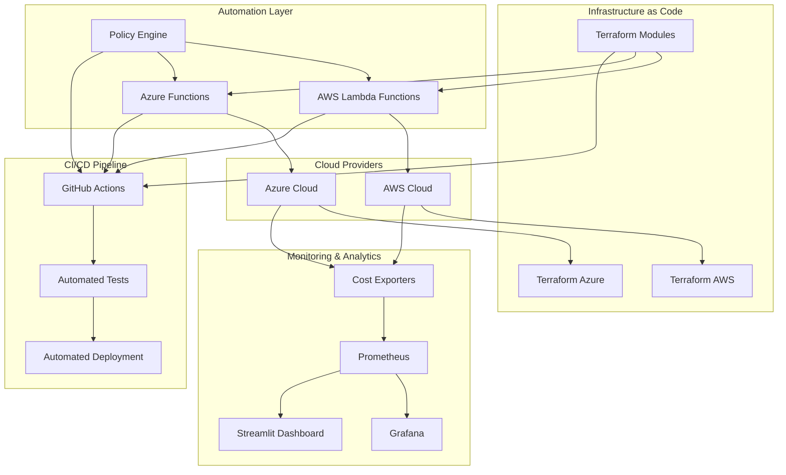
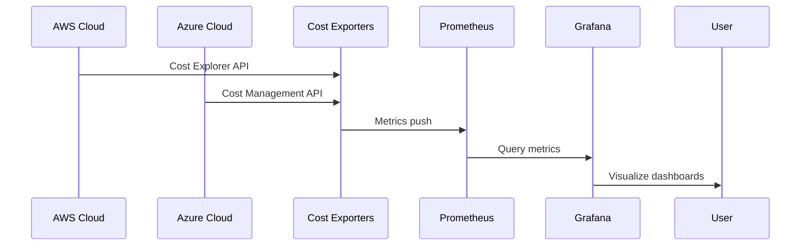
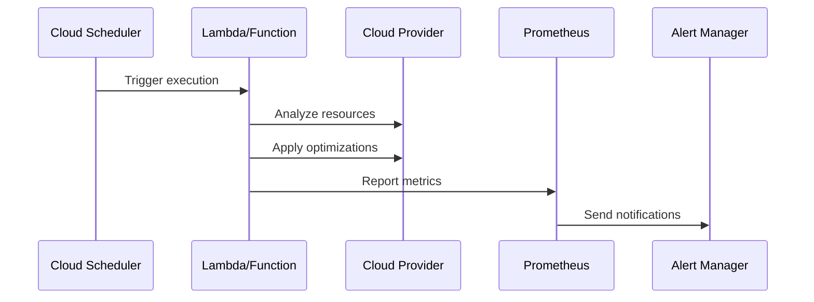

# Cost Optimization Framework - Architecture

## Overview

The Cost Optimization Framework is a comprehensive, production-ready solution for automated cloud cost analysis, right-sizing, policy enforcement, and scheduled shutdown features across AWS and Azure. This document provides detailed architectural insights into the framework's design, components, and implementation.

## High-Level Architecture



## Core Components

### 1. Infrastructure as Code (Terraform)

#### Modular Architecture
```
terraform/
├── modules/
│   ├── compute/     # EC2/VM Scale Sets
│   ├── storage/     # S3/Azure Blob
│   └── database/    # RDS/Azure SQL
├── aws/             # AWS-specific configs
└── azure/           # Azure-specific configs
```

#### Key Features
- **Reusable Modules**: Cross-cloud compatible modules with provider abstraction
- **Tagging Enforcement**: Mandatory tags for cost tracking and governance
- **Validation**: Terraform validate, tflint, and tfsec integration
- **Multi-Environment**: Support for dev, test, staging, and production

### 2. Automation Engine

#### AWS Lambda Functions
- **Auto-Shutdown**: Scheduled shutdown of idle resources
- **Right-Sizing**: CPU/memory utilization analysis and recommendations
- **Cleanup**: Removal of unattached volumes and unused snapshots
- **Cost Analysis**: Real-time cost monitoring and alerting

#### Azure Functions
- **Auto-Shutdown**: VM and VMSS automated shutdown
- **Right-Sizing**: SKU optimization recommendations
- **Resource Cleanup**: Disk and snapshot management
- **Cost Monitoring**: Azure cost and usage tracking

#### Policy Engine
- **Tagging Policies**: Enforce consistent resource tagging
- **Shutdown Policies**: Environment-based auto-shutdown rules
- **Budget Policies**: Cost threshold monitoring and alerts

### 3. Monitoring and Analytics

#### Prometheus Stack
```
monitoring/
├── prometheus.yml          # Main configuration
├── aws_cost_exporter.py    # AWS cost metrics
├── azure_cost_exporter.py  # Azure cost metrics
├── docker-compose.yml      # Container orchestration
└── grafana/
    └── dashboards/         # Pre-built dashboards
```

#### Metrics Collected
- **Cost Metrics**: Daily cost by service, region, and resource
- **Resource Metrics**: Instance counts, utilization rates
- **Budget Metrics**: Budget utilization and alerts
- **Optimization Metrics**: Savings opportunities and recommendations

#### Grafana Dashboards
- **Cost Trends**: Historical cost analysis and forecasting
- **Right-Sizing**: Under/over-provisioned resource identification
- **Idle Resources**: Automated cleanup opportunities
- **Budget Monitoring**: Real-time budget vs. actual tracking

### 4. CI/CD Pipeline

#### GitHub Actions Workflows
```yaml
# Example workflow structure
name: Cost Optimization CI/CD
on:
  push:
    branches: [ main ]
  pull_request:
    branches: [ main ]

jobs:
  terraform:
    runs-on: ubuntu-latest
    steps:
      - uses: actions/checkout@v3
      - uses: hashicorp/setup-terraform@v2
      - run: terraform validate
      - run: terraform plan

  test:
    runs-on: ubuntu-latest
    steps:
      - run: python -m pytest automation/

  deploy:
    needs: [terraform, test]
    runs-on: ubuntu-latest
    steps:
      - run: terraform apply -auto-approve
```

## Data Flow Architecture

### Cost Data Collection


### Automation Workflow


## Security Architecture

### Authentication & Authorization
- **AWS**: IAM roles with least privilege access
- **Azure**: Managed identities and service principals
- **Monitoring**: Secure API keys and certificates

### Data Protection
- **Encryption**: All sensitive data encrypted at rest and in transit
- **Access Control**: Role-based access to cost and resource data
- **Audit Logging**: Comprehensive audit trails for all operations

### Compliance
- **Tagging Policies**: Enforce data classification and ownership
- **Access Reviews**: Regular review of resource access permissions
- **Compliance Monitoring**: Automated compliance checks and reporting

## Scalability Considerations

### Horizontal Scaling
- **Serverless Functions**: Auto-scaling based on workload
- **Container Orchestration**: Kubernetes support for large deployments
- **Distributed Processing**: Parallel processing for large resource inventories

### Performance Optimization
- **Caching**: Cost data caching to reduce API calls
- **Batch Processing**: Bulk operations for efficiency
- **Async Operations**: Non-blocking automation workflows

### Cost Optimization (Irony Intended)
- **Resource Tagging**: Automated cost allocation
- **Usage Monitoring**: Real-time utilization tracking
- **Right-Sizing**: Continuous optimization recommendations

## Deployment Architecture

### Multi-Environment Support
```
Production Environment:
├── Core Infrastructure (VPC/VNet)
├── Monitoring Stack (Prometheus/Grafana)
├── Automation Functions
└── Policy Engine

Development Environment:
├── Sandbox Resources
├── Test Automation
└── CI/CD Pipeline
```

### Disaster Recovery
- **Multi-Region**: Cross-region replication for high availability
- **Backup Strategy**: Automated backups of configuration and data
- **Failover**: Automatic failover for critical components

## Integration Points

### Cloud Provider APIs
- **AWS Cost Explorer**: Cost and usage data
- **Azure Cost Management**: Billing and cost analysis
- **Resource APIs**: Instance, storage, and database management

### Third-Party Tools
- **Slack/Teams**: Notification and alerting
- **Email/SMS**: Critical alert delivery
- **SIEM**: Security event correlation
- **CMDB**: Configuration management database

### Enterprise Systems
- **ERP**: Financial system integration
- **Identity**: SSO and user management
- **Governance**: Policy and compliance frameworks

## Monitoring and Observability

### Application Metrics
- **Function Execution**: Success/failure rates and duration
- **API Calls**: Rate limiting and error tracking
- **Resource Changes**: Configuration drift detection

### Business Metrics
- **Cost Savings**: Actual vs. projected savings tracking
- **ROI**: Return on investment calculations
- **Compliance**: Policy adherence percentages

### Alerting Strategy
- **Critical**: Immediate response required (budget overruns)
- **Warning**: Action needed within hours (high utilization)
- **Info**: Awareness notifications (optimization opportunities)

## Future Enhancements

### AI/ML Integration
- **Predictive Scaling**: ML-based scaling recommendations
- **Anomaly Detection**: Advanced cost anomaly identification
- **Automated Optimization**: AI-driven resource optimization

### Multi-Cloud Extensions
- **GCP Support**: Google Cloud Platform integration
- **Hybrid Cloud**: On-premises resource optimization
- **Edge Computing**: IoT and edge resource management

### Advanced Analytics
- **Cost Forecasting**: Predictive cost modeling
- **What-If Analysis**: Scenario planning and simulation
- **Benchmarking**: Industry and peer comparison

---

This architecture provides a solid foundation for enterprise-grade cloud cost optimization while maintaining flexibility for future enhancements and integrations.
