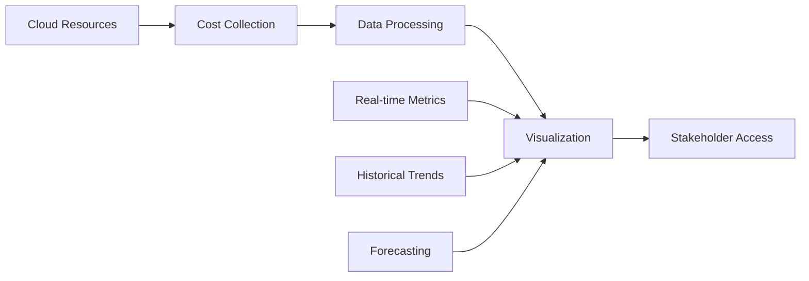

# FinOps Principles in the Cost Optimization Framework

## Overview

This document outlines how the Cost Optimization Framework implements the core principles of FinOps (Financial Operations) to drive cloud cost efficiency, accountability, and optimization across AWS and Azure environments.

## FinOps Foundation Principles

### 1. Collaboration Between Finance, Technology, and Business Teams

#### Framework Implementation
- **Cross-Functional Dashboards**: Shared visibility into costs across teams
- **Cost Allocation**: Automatic tagging and chargeback mechanisms
- **Budget Alerts**: Proactive notifications to relevant stakeholders

#### Key Features
```yaml
# Example: Multi-team cost visibility
cost_allocation:
  teams:
    - engineering
    - product
    - finance
  visibility:
    - real_time_dashboards: true
    - weekly_reports: true
    - budget_alerts: true
```

### 2. Everyone Takes Ownership for Their Cloud Usage

#### Accountability Mechanisms
- **Resource Ownership**: Mandatory Owner tags on all resources
- **Cost Center Attribution**: Department-level cost tracking
- **Personal Accountability**: Individual cost visibility and alerts

#### Implementation
```hcl
# Terraform tagging policy
resource "aws_instance" "example" {
  tags = {
    Owner       = "john.doe@company.com"
    CostCenter  = "ENG-123"
    Project     = "web-app"
    Environment = "prod"
  }
}
```

### 3. A Culture of Financial Responsibility is Promoted

#### Education and Awareness
- **Cost Training**: Automated recommendations and best practices
- **Showback Reports**: Transparent cost visibility without chargeback
- **Optimization Incentives**: Recognition for cost-saving initiatives

#### Framework Features
- **Automated Recommendations**: AI-powered right-sizing suggestions
- **Cost Anomaly Alerts**: Proactive identification of unusual spending
- **Success Metrics**: Cost savings tracking and reporting

## The Three Phases of FinOps

### Phase 1: Inform (Visibility and Allocation)

#### Cost Visibility


#### Key Capabilities
- **Granular Cost Breakdown**: Cost by service, team, project, and environment
- **Real-time Monitoring**: Live cost dashboards and alerts
- **Cost Allocation**: Accurate chargeback to business units
- **Benchmarking**: Industry and peer comparison

#### Framework Implementation
```python
# Cost visibility example
def get_cost_breakdown():
    return {
        'by_service': prometheus_query('aws_cost_total'),
        'by_team': prometheus_query('cost_by_owner_tag'),
        'by_environment': prometheus_query('cost_by_environment'),
        'anomalies': detect_anomalies()
    }
```

### Phase 2: Optimize (Rate Optimization and Usage Optimization)

#### Rate Optimization
- **Reserved Instances**: Automated RI recommendations and purchasing
- **Spot Instances**: Intelligent spot instance utilization
- **Enterprise Discounts**: Volume discount optimization
- **Resource Right-sizing**: Automated instance type optimization

#### Usage Optimization
- **Auto-shutdown**: Scheduled shutdown of idle resources
- **Resource Cleanup**: Automated removal of unused assets
- **Workload Optimization**: Container and serverless migration recommendations

#### Framework Automation
```yaml
# Auto-optimization policies
optimization_policies:
  - name: "dev-auto-shutdown"
    environments: ["dev", "test"]
    schedule: "weekdays-18:00"
    exclusions:
      - tag: "Permanent=true"

  - name: "right-sizing"
    trigger: "cpu_below_20_percent"
    duration: "7_days"
    action: "recommend_downsize"

  - name: "cleanup-unused"
    resource_types: ["volumes", "snapshots"]
    age_threshold: "30_days"
    action: "delete"
```

### Phase 3: Operate (FinOps as a Core Business Capability)

#### Continuous Optimization
- **Policy Automation**: Automated governance and compliance
- **Feedback Loops**: Continuous improvement based on results
- **Scalable Processes**: Enterprise-ready frameworks and tools

#### Framework Features
- **Policy as Code**: Declarative cost policies
- **Automated Governance**: Continuous compliance monitoring
- **Performance Tracking**: ROI and efficiency metrics

## FinOps Capabilities Matrix

| Capability | Framework Implementation | AWS | Azure |
|------------|-------------------------|-----|-------|
| **Cost Visibility** | Real-time dashboards | ✅ | ✅ |
| **Cost Allocation** | Tag-based attribution | ✅ | ✅ |
| **Budget Alerts** | Multi-threshold alerting | ✅ | ✅ |
| **Anomaly Detection** | ML-based analysis | ✅ | ✅ |
| **Reserved Instance Mgmt** | Automated purchasing | ✅ | ✅ |
| **Right-sizing** | Automated recommendations | ✅ | ✅ |
| **Auto-shutdown** | Scheduled optimization | ✅ | ✅ |
| **Resource Cleanup** | Automated cleanup | ✅ | ✅ |
| **Policy Enforcement** | Declarative policies | ✅ | ✅ |
| **Chargeback/Showback** | Automated reporting | ✅ | ✅ |

## Cost Optimization Strategies

### 1. Reserved Instance/Cost Savings Plan Optimization

#### Framework Approach
```python
# RI optimization logic
def optimize_reservations():
    # Analyze usage patterns
    usage = get_usage_patterns()

    # Calculate optimal RI coverage
    recommendations = calculate_ri_recommendations(usage)

    # Generate purchase recommendations
    return {
        'recommended_ris': recommendations,
        'estimated_savings': calculate_savings(recommendations),
        'break_even_analysis': calculate_break_even(recommendations)
    }
```

#### Key Metrics
- **RI Coverage**: Percentage of resources covered by reservations
- **RI Utilization**: How effectively RIs are being used
- **Savings Rate**: Actual vs. on-demand costs

### 2. Workload Right-sizing

#### Intelligent Right-sizing
```yaml
# Right-sizing policy
rightsizing_policy:
  triggers:
    - metric: "cpu_utilization"
      threshold: 20
      duration: "168h"  # 7 days
      action: "downsize"

    - metric: "memory_utilization"
      threshold: 80
      duration: "24h"
      action: "upsize"

  recommendations:
    - current_type: "t3.large"
      recommended_type: "t3.medium"
      estimated_savings: "$50/month"
      confidence: "high"
```

### 3. Storage Optimization

#### Lifecycle Management
```yaml
# Storage lifecycle policy
storage_optimization:
  transitions:
    - age: "30d"
      storage_class: "STANDARD_IA"
      savings: "20%"

    - age: "90d"
      storage_class: "GLACIER"
      savings: "65%"

    - age: "365d"
      action: "delete"
      savings: "100%"
```

### 4. Idle Resource Management

#### Automated Cleanup
```python
# Idle resource detection
def detect_idle_resources():
    idle_thresholds = {
        'ec2': {'cpu_percent': 5, 'duration_hours': 168},  # 7 days
        'rds': {'connections': 0, 'duration_hours': 72},   # 3 days
        'storage': {'access_days': 90}                     # 90 days
    }

    idle_resources = []
    for resource_type, thresholds in idle_thresholds.items():
        idle = find_idle_resources(resource_type, thresholds)
        idle_resources.extend(idle)

    return idle_resources
```

## Measurement and Metrics

### Key Performance Indicators (KPIs)

#### Unit Economics
- **Cost per User/Customer**: Cloud cost divided by business metrics
- **Cost per Transaction**: Infrastructure cost per business transaction
- **Cost per Feature**: Development and operational costs

#### Efficiency Metrics
- **Cloud Cost as % of Revenue**: Total cloud spend vs. company revenue
- **Cost per Server**: Average cost per compute instance
- **Resource Utilization**: Average CPU/memory utilization across resources

#### Optimization Metrics
- **Cost Savings Achieved**: Actual dollars saved through optimization
- **Time to Optimization**: Speed of implementing cost-saving measures
- **Automation Rate**: Percentage of cost optimizations automated

### Reporting and Analytics

#### Executive Dashboards
- **Cost Trends**: Month-over-month and year-over-year cost analysis
- **Budget Performance**: Budget vs. actual spending with variance analysis
- **ROI Tracking**: Return on investment for optimization initiatives

#### Operational Dashboards
- **Real-time Alerts**: Immediate notification of cost anomalies
- **Optimization Opportunities**: Prioritized list of cost-saving actions
- **Policy Compliance**: Adherence to cost governance policies

## Governance and Control

### Policy Framework
```yaml
# FinOps governance policy
finops_governance:
  policies:
    - name: "mandatory_tagging"
      enforcement: "hard_stop"
      scope: "all_resources"
      remediation: "auto_tag"

    - name: "budget_thresholds"
      thresholds: [50, 75, 90, 100]
      actions: ["notify", "warn", "shutdown", "emergency"]

    - name: "approval_workflows"
      cost_threshold: 1000
      approvers: ["finance", "engineering_lead"]
```

### Compliance Monitoring
- **Policy Adherence**: Automated checking of cost policies
- **Audit Trails**: Complete history of cost-related decisions
- **Exception Management**: Controlled exceptions to policies

## Implementation Roadmap

### Phase 1: Foundation (Weeks 1-4)
- [ ] Deploy basic monitoring and tagging
- [ ] Implement cost visibility dashboards
- [ ] Establish initial policies and governance

### Phase 2: Optimization (Weeks 5-12)
- [ ] Deploy auto-shutdown and cleanup automation
- [ ] Implement right-sizing recommendations
- [ ] Set up budget alerts and controls

### Phase 3: Maturity (Weeks 13-24)
- [ ] Advanced analytics and forecasting
- [ ] AI/ML-driven optimization
- [ ] Enterprise integration and scaling

### Success Metrics
- **Cost Reduction**: Target 20-40% reduction in cloud costs
- **Process Efficiency**: 80% of optimizations automated
- **Stakeholder Satisfaction**: Positive feedback from all teams
- **Compliance Rate**: 95%+ adherence to cost policies

## Conclusion

The Cost Optimization Framework provides a comprehensive implementation of FinOps principles, enabling organizations to achieve financial accountability, operational efficiency, and continuous cost optimization in their cloud environments. By following the three phases of FinOps and leveraging automated capabilities, teams can build a culture of cost consciousness while maintaining agility and innovation.
